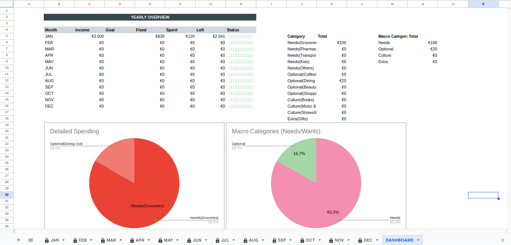
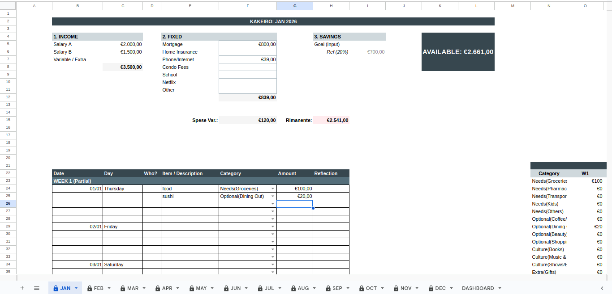
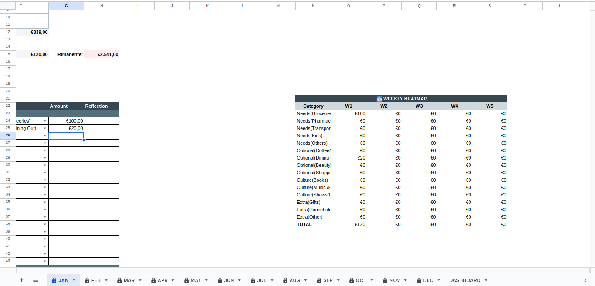

# 📊 Automated Kakeibo Digital Budget (Google Sheets)

Automated Google Apps Script that transforms a blank Google Sheet into a fully functional **Kakeibo (Japanese Household Ledger)**.

This system handles date generation, layout formatting, visual grouping, and automatic weekly/yearly analysis allowing you to focus on your spending habits, not spreadsheet formulas.



<a href="https://www.buymeacoffee.com/srosignoli" target="_blank"></a>

## ✨ Features

* **Fixed Block Layout:** Generates a paper-like feel with 5 rows per day (expandable).
* **Smart Automation:** Automatically calculates dates, day names, and week numbers based on the selected year.
* **Dynamic Configuration:** Easily customize Income sources, Fixed Expenses, and Spending Categories directly in the script.
* **Weekly Heatmaps:** Automatic analysis of spending habits per week to identify trends.
* **Visual Dashboard:** Yearly overview with "Macro" (Needs vs. Wants) and "Micro" (Category) breakdowns, plus visual status indicators.
* **Safe Updates:** A "Non destructive" update mode allows you to change categories or layout settings without deleting your existing transaction data.
* **Euro/Italian Locale:** Optimized for `it_IT` locale (€ currency, DD/MM dates, semicolon formulas).

## 🚀 Installation

1.  Open a new or existing **Google Sheet**.
2.  Go to **Extensions** > **Apps Script**.
3.  Delete any existing code in the editor (`Code.gs`).
4.  Create a new file named `KakeiboSystem.gs` (or use the default `Code.gs`) and paste the content of the script from this repository.
5.  **Edit the `CONFIG` section** at the top of the script to match your specific needs (see Configuration below).
6.  Click the **Save** icon.
7.  Reload your Google Sheet browser tab.
8.  You will see a new menu item called **"Kakeibo Settings"** appear in the toolbar.

## 🔐 Authorization Guide (Important!)

When you run the script for the very first time (e.g., when clicking "Factory Reset"), Google will ask for permission. Because this script is open source and not published on the official Google Web Store, you will see a warning screen.

**This is normal.** Here is how to proceed safely:

1.  A window will pop up. Click **Review Permissions**.
2.  Select your Google Account.
3.  You will see a scary screen saying **"Google hasn't verified this app"**.
    * *Why?* Because this is a custom script you just pasted, not a product from a big company.
4.  Click **Advanced** (bottom left).
5.  Click **Go to KakeiboSystem (unsafe)** (bottom link).
6.  Click **Allow** to let the script edit your spreadsheet.

**Note on Privacy:** This script runs 100% inside your Google account. No data is ever sent to the developer or any third party. You can verify this by looking at the code yourself!

## ⚙️ Configuration

At the very top of the script, you will find the `CONFIG` object. Edit these lists to customize the sheet for your life.

```javascript
var CONFIG = {
  rowsPerDay: 5,  // Number of transaction rows per day
  year: 2025,     // Default year (can be changed via prompt)
  currency: "€",
  
  // Define your Income Sources
  incomeItems: ["Salary A", "Salary B", "Freelance"],
  
  // Define your Fixed Monthly Expenses
  fixedExpenses: ["Rent/Mortgage", "Internet", "Insurance", "Netflix"],
  
  // Define your Spending Categories
  categories: [
    "Needs(Food)", "Needs(Transport)", 
    "Optional(Dining Out)", "Optional(Hobbies)", 
    "Culture(Books)", "Extra(Gifts)"
  ],
  // ...
};
```

## 🛠️ Script Usage Guide

Once the script is installed and you refresh your Google Sheet, a custom menu titled **"Kakeibo Settings"** will appear in the toolbar. This menu provides two distinct modes for managing your workbook.

### 1. ⚠️ Factory Reset (Wipe All)

> **Warning:** This mode is destructive. It deletes **everything** in the spreadsheet.

* **Function Name:** `setupFixedBlockKakeibo`
* **When to use:**
    * Setting up the sheet for the very first time.
    * Starting a fresh workbook for a new year (e.g., transitioning from 2024 to 2025).
    * If you want to completely restart your budgeting for the current year.
* **What it does:**
    1.  Prompts you for the Fiscal Year.
    2.  Deletes all existing monthly sheets and the dashboard.
    3.  Generates a fresh set of sheets based on the current `CONFIG`.
* **Result:** A new, empty Kakeibo workbook.

---

### 2. 🔄 Update Configuration (Keep Data)

> **Note:** This mode is "Non-Destructive". It is designed to preserve your logs and input values.

* **Function Name:** `updateKakeiboSafe`
* **When to use:**
    * You forgot to add a specific category (e.g., "Gym") in the script `CONFIG`.
    * You need to add a new Fixed Expense item (e.g., "Car Loan") halfway through the year.
    * You want to change the number of rows per day or column widths.
* **How it works:**
    1.  **Scrape:** It reads your current sheet and stores all Income values, Fixed Expense values, Savings Goals, and Daily Log entries into memory.
    2.  **Rebuild:** It deletes the old sheets and generates new ones using your updated `CONFIG` settings.
    3.  **Restore:** It writes your saved data back into the new layout, matching dates and categories.
* **Important Constraint:**
    * **Do not rename existing items** in `CONFIG` if you want to keep their data.
    * *Example:* If you rename "Netflix" to "Streaming", the script will not know they are the same thing, and the value associated with "Netflix" will be dropped.
    * **Best Practice:** Add new items to the end of the lists in `CONFIG`.

## 📖 User Guide: How to use the Kakeibo System

### Step 1: Monthly Planning (Top Section)
At the start of every month, fill out the top grey section:
1.  **Income:** Enter your expected earnings for the month.
2.  **Fixed Expenses:** Enter your bills (Rent, Utilities, etc.).
3.  **Savings Goal:** Enter your target savings in cell **I5**.
    * *Tip:* The sheet calculates a reference "20% Goal" in cell I6 to help you aim high.
4.  **Available Budget:** The big dark box calculates exactly how much "Variable Money" you have left to spend for the month.

### Step 2: Daily Logging
Scroll down to the current date (visually grouped by day blocks).



* **Log Expenses:** Enter the Item, select a Category, and enter the Amount.
* **Reflection:** Use the last column to write a brief note (e.g., "Impulse buy" or "Necessary").
* **Expansion:** If you run out of rows for a specific day, simply right-click a row and select "Insert Row Below". **Important:** Copy the date into the new row so the formulas include it in the weekly totals.

### Step 3: Weekly & Yearly Review
* **Weekly Heatmap (Right Side):** The table on the right of every month automatically sums up your spending by category and week.



* **The Dashboard:** Click the `DASHBOARD` tab for a high-level view.


* **Status Bar:** Shows a progress bar of your budget.
    * 🟢 **Green:** You are within budget.
    * 🔴 **Red:** You have overspent.
* **Macro Analysis:** Check the Pie Charts to see the balance between your **Needs**, **Optional**, **Culture**, and **Extra** spending.

## ☕ Support the Project

If this script saved you time or helped you organize your finances, consider buying me a coffee! It keeps the motivation high to add new features.

[Buy me a coffee](https://www.buymeacoffee.com/srosignoli)